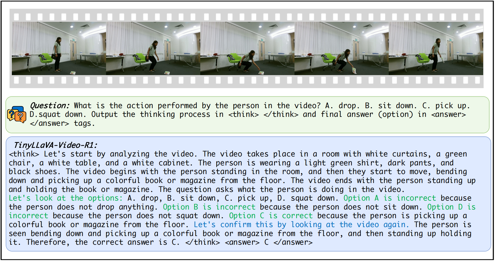

# SurgPub-Video

Official implementation for:

**SurgPub-Video: A Comprehensive Surgical Video Framework for Enhanced Surgical
Intelligence in Vision-Language Model**.

SurgPub-Video is accepted to **AAAI 2026**. This repository provides
annotations, preprocessing scripts, training code, and evaluation entrypoints
for surgical video-language understanding.

<div align="center">

[](https://arxiv.org/abs/2504.09641)
[](https://huggingface.co/datasets/Wallice/SurgPub-Video)
[](https://huggingface.co/Wallice/SurgPub-Benchmark)
[](https://huggingface.co/Wallice/SurgPub-RARP50)

</div>

<div align="center">

</div>

## Overview

SurgPub-Video experiments use extracted video frames as visual inputs. The
repository is organized as:

```text
annotations/  # QA annotations and evaluation metadata
dataset/      # downloaded videos and extracted frames
preprocess/   # data download and frame extraction scripts
scripts/      # training and evaluation entrypoints
tinyllava/    # model, dataset, training, and evaluation code
```

For detailed data preparation notes, see [DATA_PREPARATION.md](DATA_PREPARATION.md).

## Installation

```bash
conda create -n surgpub-video python=3.10 -y
conda activate surgpub-video

pip install --upgrade pip
pip install -e .
pip install flash-attn==2.7.3 --no-build-isolation
python3 -m pip install -U yt-dlp huggingface_hub
```

Install `ffmpeg` with your system package manager, for example:

```bash
brew install ffmpeg
# or
sudo apt-get install -y ffmpeg
```

## Data

Download released annotations:

```bash
huggingface-cli download Wallice/SurgPub-Video \
  --repo-type dataset \
  --local-dir annotations \
  --include "bench/*" "rarp/*" \
  --local-dir-use-symlinks False
```

Video URL metadata requires access approval:

```text
https://forms.gle/wPMv5CkZXuHt83wc9
```

After approval, place the received CSV at `preprocess/video_url.csv`, then
download videos and extract 1 FPS frames:

```bash
python3 preprocess/download_video_frames.py \
  --csv preprocess/video_url.csv \
  --target-dir dataset/surgpub \
  --id-col id \
  --url-col video_url \
  --backend ffmpeg \
  --skip-existing
```

Expected layout:

```text
dataset/
  surgpub/<video_id>/frames/frame_00000.png
  RARP50/<split>/<case>/frame/000000001.png
```

For RARP50, download the original videos from the SAR-RARP50 project page and
run:

```bash
RARP_ROOT=$PWD/dataset/RARP50 SPLIT=trainset bash preprocess/RARP_preprocess.sh
RARP_ROOT=$PWD/dataset/RARP50 SPLIT=testset bash preprocess/RARP_preprocess.sh
```

## Checkpoints

Download the TinyLLaVA-Video base checkpoint for training:

```bash
export MODEL_ROOT=/path/to/models
mkdir -p "$MODEL_ROOT"

huggingface-cli download Zhang199/TinyLLaVA-Video-Qwen2.5-3B-Group-16-512 \
  --local-dir "$MODEL_ROOT/TinyLLaVA-Video-Qwen2.5-3B-Group-16-512" \
  --local-dir-use-symlinks False
```

Released trained checkpoints:

- Benchmark: [Wallice/SurgPub-Benchmark](https://huggingface.co/Wallice/SurgPub-Benchmark)
- RARP50: [Wallice/SurgPub-RARP50](https://huggingface.co/Wallice/SurgPub-RARP50)

## Training

Benchmark training:

```bash
MODEL_ROOT=/path/to/models \
DATA_ROOT=$PWD/dataset \
bash scripts/train/train_bench.sh
```

RARP50 training:

```bash
MODEL_ROOT=/path/to/models \
DATA_ROOT=$PWD/dataset \
bash scripts/train/train_rarp.sh
```

Common runtime overrides include `GPUS`, `MASTER_PORT`, `NUM_FRAME`,
`NUM_EPOCHS`, and `OUTPUT_DIR`.

## Evaluation

Benchmark evaluation:

```bash
MODEL_PATH=/path/to/checkpoint \
DATA_ROOT=$PWD/dataset \
VIDEO_PATH=$PWD/dataset/surgpub \
EVAL_INPUT=annotations/bench/qa_test.csv \
bash scripts/eval/eval_bench.sh
```

RARP50 evaluation:

```bash
MODEL_PATH=/path/to/rarp/checkpoint \
DATA_ROOT=$PWD/dataset \
EVAL_INPUT=annotations/rarp/qa_test.json \
bash scripts/eval/eval_rarp.sh
```

Evaluation scripts print accuracy and save per-sample predictions to CSV.

## Notes

- Training uses Deepspeed and CUDA.
- `MODEL_PATH` can point to any local checkpoint compatible with
  `tinyllava.model.load_model.load_pretrained_model`.
- `preprocess/download_video_frames.py` processes each `id` once by default.

## Contact

For questions or suggestions, please contact `zhangxingjian@buaa.edu.cn`.

## Acknowledgements

This repository is built upon the open-source
[TinyLLaVA-Video](https://github.com/ZhangXJ199/TinyLLaVA-Video) framework. We
thank the TinyLLaVA authors and contributors for releasing their codebase and
model infrastructure.

## Citation

If you find this repository useful, please cite our paper:

```bibtex
@inproceedings{li2026surgpub,
  title={SurgPub-Video: A Comprehensive Surgical Video Framework for Enhanced Surgical Intelligence in Vision-Language Model},
  author={Li, Yaoqian and Yang, Xikai and Xu, Dunyuan and Yu, Yang and Zhao, Litao and Hu, Xiaowei and Li, Jinpeng and Heng, Pheng-Ann},
  booktitle={Proceedings of the AAAI Conference on Artificial Intelligence},
  volume={40},
  number={8},
  pages={6628--6635},
  year={2026}
}
```
